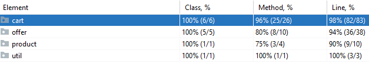

Project Layout
----

It is a Gradle project, import it in Eclipse/IntelliJ

* `src` - contains source code
* `test` - contains unit test cases
* `functionalTest` - contains functional test cases

Code Coverage
----
Maintained high code coverage

Progress
---
All 7 steps of the Shopping Cart Kata have been completed.

Domain
----
The solution has been designed keeping in mind Supermarket cart scenario, in which
as soon as products are added to cart, the offers are reflected and discount is reflected
which is visible on the screen.

Design
---

**ShoppingCart**

* Is responsible for maintaining the state of cart items. It is an immutable object. The class is not thread safe
but can be made by use of proper synchronization and using `ConcurrentHashMap`
* Communicates with the `OfferService` to apply product and cart offers
* Applies tax on discounted amount

**OfferService**
* Is entry point to offer domain
* Provides APIs to apply product and cart offer

**ProductOffer**
* Abstraction for applying product offers
* Known implementations
    * `Buy1Get50PercentOffOnNextOffer`
    * `Buy2Get1Offer`
    
**CartOffer**
* Abstraction for applying cart offers
* Known implementations
    * `Flat20PercentOffOffer`
    

